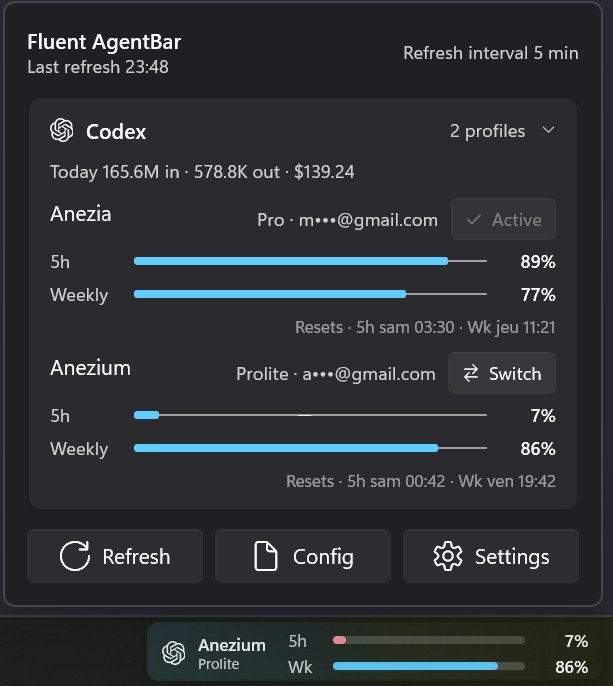
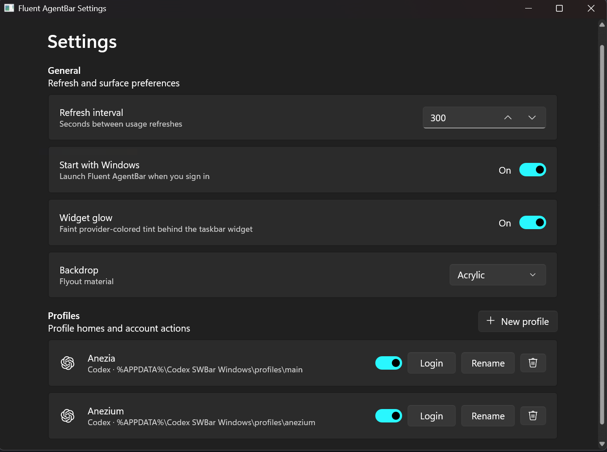
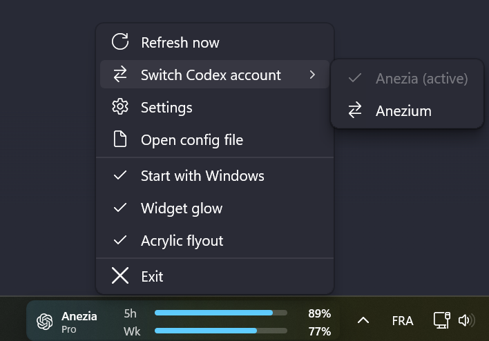

# Fluent AgentBar

WinUI 3 Windows taskbar presence inspired by CodexBar, covering Codex, Claude, Gemini CLI, Cursor and Grok.

Active app: `winui\FluentAgentBar.csproj`. Active verification: `.\scripts\verify-winui.ps1`.
The legacy C++ implementation in `src/` and `build.ps1` is kept only as a historical reference and should not be used for new WinUI validation.

This app provides:

- WinUI 3 taskbar widget and DPI-aware flyout for high-resolution Windows displays.
- Windows 11 Fluent surfaces with Mica-like settings and Acrylic-like flyouts.
- Explorer taskbar integration through WPF `WS_CHILD` widgets embedded in each
  taskbar, with automatic owned/topmost fallback if child adoption fails.
- One taskbar presence per detected primary/secondary Windows taskbar.
- Multi-provider profile support through separate `CODEX_HOME` / `CLAUDE_CONFIG_DIR` directories.
- Codex account discovery through `codex app-server`.
- Codex login per isolated profile through app-server browser auth.
- One-click Codex account switching from the flyout or taskbar context menu, with Codex force-close and reopen flow.
- Settings controls for startup, profile creation, rename, enable/disable, folder open, and refresh config.
- Claude usage through configured Claude CLI credential directories.
- Gemini CLI, Cursor and Grok usage through the credentials those tools already store on disk (see Supported providers).
- Local token and USD cost summaries from Codex and Claude session logs.
- Local config at `%APPDATA%\Fluent AgentBar\config.json`.

Token statistics include active journals and older Codex sessions resumed within
the last seven days. Costs use the published standard API rates as an estimate;
they do not represent subscription charges or include Fast mode, 1-hour cache
writes, or long-context premiums.

Model prices update without an app release. Once a day AgentBar downloads
[LiteLLM's public price list](https://github.com/BerriAI/litellm/blob/main/model_prices_and_context_window.json)
and caches the Anthropic and OpenAI entries in
`%APPDATA%\Fluent AgentBar\model-pricing-cache.json`. When offline, or for a
model LiteLLM has not listed yet, a built-in table prices it by model family.
If a model has no known price at all, its tokens are still counted and the cost
reads as a minimum (`≥ $12.34`).

To fix a price by hand, create `%APPDATA%\Fluent AgentBar\pricing-overrides.json`.
Overrides beat every other source, match by model id prefix, and are reloaded
when the file changes. Prices are USD per million tokens; omitted cache prices
default to 0.1× (read) and 1.25× (write) the input price:

```jsonc
{
  "claude-opus-5-5": { "input": 4, "output": 20, "cacheRead": 0.2, "cacheWrite": 5 },
  "gpt-6-nova": { "input": 3, "output": 15 }
}
```

## Supported providers

Each profile names a provider and a home directory. Codex and Claude profiles get
their own app-managed folder, so the same machine can hold several accounts side by
side. Gemini, Cursor and Grok read the state of the installed tool instead, so their
home is that tool's own directory and the profile name is only a label.

| Provider | Credentials read from | Login action |
| --- | --- | --- |
| Codex | `CODEX_HOME`, by default `%APPDATA%\Fluent AgentBar\profiles\<profile>`; accounts and quotas come from `codex app-server` | `codex login` in a hidden console, which opens the browser flow |
| Claude | `CLAUDE_CONFIG_DIR`, by default `%USERPROFILE%\.claude` for the first profile and `%APPDATA%\Fluent AgentBar\profiles\claude-<profile>` afterwards | `claude /login` in a visible console |
| Gemini | the Antigravity CLI (`agy -p /usage`) when it is installed and signed in; otherwise `%USERPROFILE%\.gemini\oauth_creds.json` written by the Gemini CLI (Google stopped serving consumer Gemini CLI OAuth in June 2026) | `gemini` in a visible console; run `agy` once to sign in to Antigravity |
| Cursor | `%APPDATA%\Cursor\auth.json` written by the `cursor-agent` CLI, or the session stored by the Cursor desktop app in `state.vscdb`; the freshest unexpired token wins | `cursor-agent login` in a visible console when the CLI is installed, otherwise opens <https://cursor.com/dashboard> and you sign in inside the Cursor app |
| Grok Build | `%USERPROFILE%\.grok`, written by the Grok CLI | `grok login` in a visible console; install the CLI from <https://x.ai/cli> (the published `install.sh` is macOS/Linux only) |

Codex and Claude expose a short rolling window plus a weekly window. Claude also
reports model-scoped weekly windows — a premium model such as Fable gets its own
weekly quota — which the flyout shows as a separate group under the account.

## Screenshots







On first run, Fluent AgentBar may copy a legacy config from
`%APPDATA%\Codex SWBar Windows\config.json` when the current config file does
not exist. The active config path remains
`%APPDATA%\Fluent AgentBar\config.json`.

## Build

Requires the .NET 8 SDK.

```powershell
dotnet build winui\FluentAgentBar.csproj -c Debug -p:Platform=x64
```

The executable is written to `winui\bin\x64\Debug\net8.0-windows10.0.19041.0\win-x64\FluentAgentBar.exe`.

Run the WinUI test suite with:

```powershell
dotnet test winui\FluentAgentBar.Tests\FluentAgentBar.Tests.csproj -c Debug
```

Run the full WinUI verification baseline with:

```powershell
.\scripts\verify-winui.ps1
```

`build.ps1` is the legacy C++ build path only; it is not the validation command for new WinUI work.

## Run

```powershell
.\winui\bin\x64\Debug\net8.0-windows10.0.19041.0\win-x64\FluentAgentBar.exe
```

The app starts in the background and creates a compact usage widget for each detected Windows taskbar. Left-click any widget to open the shared usage flyout. Right-click a widget for a context menu with Refresh now, Switch Codex account, Settings, Open config file, quick toggles (start with Windows, widget glow, acrylic flyout), and Exit. Launching the executable again focuses the existing instance's Settings window. Use `--show-settings` to show Settings explicitly, or `--show-flyout` to show the usage flyout.

## Multi-provider Profiles

Use Settings to add, rename, enable/disable, and log in profiles. `Settings`
updates refresh timing and the Claude provider toggle without opening the JSON.

You can still edit `%APPDATA%\Fluent AgentBar\config.json` directly:

```json
{
  "refreshIntervalSeconds": 300,
  "flyoutStyle": "acrylic",
  "profiles": [
    {
      "provider": "codex",
      "label": "Main",
      "home": "%APPDATA%\\Fluent AgentBar\\profiles\\main",
      "enabled": true
    },
    {
      "provider": "codex",
      "label": "Work",
      "home": "%APPDATA%\\Fluent AgentBar\\profiles\\work",
      "enabled": true
    },
    {
      "provider": "claude",
      "label": "Personal",
      "home": "%USERPROFILE%\\.claude",
      "enabled": true
    }
  ]
}
```

Each Codex profile is refreshed with its own `CODEX_HOME`. Each Claude profile
is refreshed with its own `CLAUDE_CONFIG_DIR`; the default Claude profile uses
`%USERPROFILE%\.claude` so an existing Claude CLI login is reused.
If `CLAUDE_CODE_OAUTH_TOKEN` is set, AgentBar uses it as the Claude OAuth access
token override for usage reads. The token is read from the process, user, or
machine environment and is not written to `.credentials.json`.

Use the profile card `Login` button to authenticate a profile. The app keeps
Codex credentials in that profile's `CODEX_HOME`, so it does not log out or
modify your normal `%USERPROFILE%\.codex` session. Claude login runs
`claude /login` with the profile's `CLAUDE_CONFIG_DIR`.

Use `Switch` in the flyout, or `Switch Codex account` from the taskbar context
menu, to promote a signed-in Codex profile into `%USERPROFILE%\.codex`. AgentBar
closes running Codex app sessions first and reopens Codex after the switch so
the desktop app picks up the new account.

## Current Limitations

- Codex account and quota RPC are wired through `codex app-server`.
- Codex profile login is implemented with app-server browser auth for the current local Codex CLI version.
- Claude quota parsing is wired through local Claude OAuth credentials or `CLAUDE_CODE_OAUTH_TOKEN`.
- Cookie import and OAuth repair flows are not ported yet.
